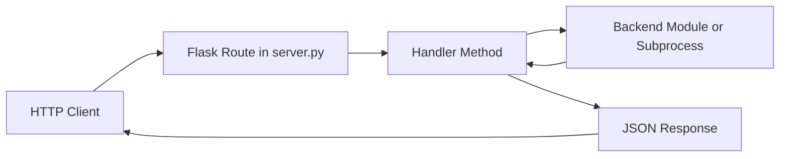

# Command and Server Flow

## Purpose

This document explains how requests and commands move through the configurator stack:

1. HTTP API route
2. Handler method
3. Backend command execution (systemctl, subprocess, DBus, helper modules)
4. Response payload

It is intended as an architecture map for debugging and onboarding.

## Entry Points

### Service startup

- `config-server` starts the Flask/Waitress API service (entrypoint in setup.py).
- `ConfigAPIServer` in src/server.py creates all handlers during initialization.

### CLI commands

Console scripts are registered in setup.py and map to module `main()` functions, for example:

- `config-server` -> configurator.server:main
- `config-ble-provision` -> configurator.ble_provisioning:main
- `config-sambamount` -> configurator.sambamount:main
- `config-avahi` -> configurator.avahi:main

## Core Routing Flow

In src/server.py, `_register_routes()` maps each endpoint to a handler method. The server itself mostly does routing and uniform JSON error responses; command side effects happen in handlers and backend modules.

## Quick Source Map

| Endpoint/Command Group | Route/Entry File | Primary Handler/Backend Files |
| --- | --- | --- |
| API route registration | src/server.py | src/handlers/__init__.py |
| systemd endpoints | src/server.py | src/handlers/systemd_handler.py, src/systemd_service.py |
| script execution endpoints | src/server.py | src/handlers/script_handler.py |
| reboot/shutdown endpoints | src/server.py | src/handlers/system_handler.py |
| SMB endpoints | src/server.py | src/handlers/smb_handler.py, src/sambaclient.py, src/sambamount.py |
| Bluetooth endpoints | src/server.py | src/handlers/bluetooth_handler.py, src/bluetooth.py |
| BLE provisioning endpoints | src/server.py | src/handlers/ble_handler.py |
| BLE runtime service | systemd/ble-provisioning.service | src/ble_provisioning.py, setup.py |
| ALSA/asound command | setup.py (`config-asoundconf`) | src/asoundconf.py |
| config key/settings endpoints | src/server.py | src/configdb.py, src/settings_manager.py |

## High-Impact Command Flows

### 1. systemd operations

Route family:

- `/api/v1/systemd/services`
- `/api/v1/systemd/service/<service>`
- `/api/v1/systemd/service/<service>/<operation>`

Execution path:

- server.py -> `SystemdHandler`
- `SystemdHandler` delegates to `SystemdServiceManager` in src/systemd_service.py
- `SystemdServiceManager` executes `systemctl` commands (system or user context)

Notes:

- Permission level is read from config (`all` vs `status`).
- Unknown services return 404 before command execution.

### 2. arbitrary configured scripts

Route family:

- `/api/v1/scripts`
- `/api/v1/scripts/<script_id>`
- `/api/v1/scripts/<script_id>/execute`

Execution path:

- server.py -> `ScriptHandler`
- `ScriptHandler` loads script definitions from `/etc/configserver/configserver.json`
- validates path + executable bit
- executes via `subprocess.run`
  - synchronous mode with timeout
  - background mode via thread

Notes:

- This is the most direct route for launching external commands from API.
- Command arguments come from preconfigured script definitions.

### 3. reboot/shutdown system commands

Routes:

- `/api/v1/system/reboot`
- `/api/v1/system/shutdown`

Execution path:

- server.py -> `SystemHandler`
- Handler validates optional delay
- Starts background thread
- Thread runs:
  - `/usr/sbin/reboot`
  - `/usr/sbin/shutdown now`

### 4. SMB mount orchestration

Route family:

- `/api/v1/smb/*`

Execution path (mount-all is the key command path):

- server.py -> `SMBHandler.handle_mount_all_samba`
- optional unmount stale mounts (`umount`)
- restart `sambamount.service` via `systemctl restart`
- trigger MPD reconcile via `systemctl start hifiberry-mpd-reconcile.service`

Notes:

- Maintains temporary mount state in `/tmp/sambamount_state.json`.

### 5. BLE provisioning service control

Routes:

- `/api/v1/ble/provisioning/status`
- `/api/v1/ble/provisioning/start`
- `/api/v1/ble/provisioning/stop`

Execution path:

- server.py -> `BLEProvisioningHandler`
- status uses `systemctl is-active ble-provisioning`
- start/stop use `systemctl start|stop ble-provisioning`
- start/stop also manage runtime override + daemon-reload

Related runtime:

- systemd unit `systemd/ble-provisioning.service` calls:
  - `config-ble-provision --check-network` (ExecStartPre)
  - `config-ble-provision --serve` (ExecStart)

### 6. ALSA asound.conf CLI flow

Entry point:

- `config-asoundconf` -> `configurator.asoundconf:main` (setup.py)

Execution path:

1. CLI parses args in `parse_arguments()` from src/asoundconf.py:
  - `--default`
  - `--hw` (default `0`)
  - `--channels` (default `2`)
2. `main()` creates `ALSAConfig` targeting `/etc/asound.conf` by default.
3. `ALSAConfig.load_config()` reads existing file content (or initializes empty config).
4. If `--default` is set:
  - `create_simple_config(hw, channels)` renders `SIMPLE_CONFIG_TEMPLATE`.
  - `save()` compares MD5 checksums and writes only if content changed.
5. CLI prints one of:
  - `Configuration saved.`
  - `No changes to save.`
  - `No --default flag provided, no configuration created.`

Notes:

- This flow is currently CLI-only; there is no direct `/api/v1/*` route mapped to src/asoundconf.py in src/server.py.
- Primary side effect is writing `/etc/asound.conf` when generated content differs from the existing file.

## Bluetooth API and DBus path

Routes:

- `/api/v1/bluetooth/settings`
- `/api/v1/bluetooth/paired-devices`
- `/api/v1/bluetooth/unpair`
- `/api/v1/bluetooth/passkey`
- `/api/v1/bluetooth/modal`

Execution path:

- server.py -> `BluetoothHandler` -> src/bluetooth.py
- `get_paired_devices` and `unpair_device` use DBus (`dbus_fast`) against BlueZ (`org.bluez`)

Important behavior note:

- In the current code, `get_paired_devices()` and `unpair_device()` are async in src/bluetooth.py, while `BluetoothHandler` calls them synchronously. This should be reviewed if runtime behavior is inconsistent.

## Configuration DB Flow

Route family:

- `/api/v1/key/*`
- `/api/v1/settings/*`
- `/api/v1/setup/*`

Execution path:

- server.py delegates to `ConfigDB` and `SettingsManager`
- mostly local DB/config mutations; no external command execution required for basic key operations

## Error and Response Pattern

- Handler methods typically return `{status, message, data}` JSON.
- Command failures are usually mapped to HTTP 4xx/5xx with stderr/error strings.
- Server-level error handlers in server.py provide fallback JSON for 400/404/500.

## Related docs

- docs/api-documentation.md
- docs/asoundconf-command-flow.md
- docs/avahi-command-flow.md
- docs/bluetooth-command-server-flow.md
